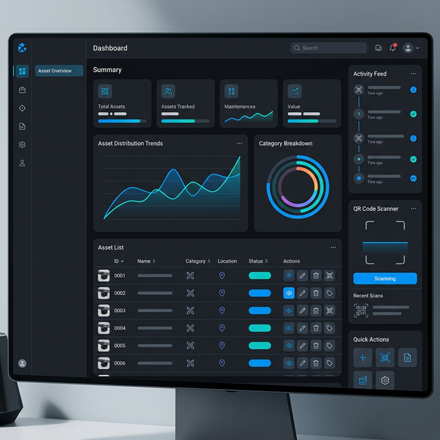

<div align="center">

# 🏛️ Zim Open University Asset Register

[](https://opensource.org/licenses/MIT)
[](https://nextjs.org/)
[](https://www.typescriptlang.org/)
[](https://tailwindcss.com/)
[](https://sqlite.org/)

**A premium, high-performance asset management solution tailored for Zimbabwe Open University.**

[Explore Docs]() · [Report Bug](https://github.com/PraiseTechzw/asset-register/issues) · [Request Feature](https://github.com/PraiseTechzw/asset-register/issues)



</div>

---

## 🚀 Overview

The **Asset Register** is a state-of-the-art asset tracking system designed to streamline the management of institutional resources. From real-time QR scanning to deep-dive analytics, it provides a comprehensive 360-degree view of all physical assets across all campuses.

### ✨ Key Features

-   **🔍 Smart Search & Filter**: Find any asset in milliseconds with advanced metadata filtering and category sorting.
-   **📷 QR Integration**: Seamlessly bridge physical and digital worlds with zero-lag QR scanning for asset identification.
-   **📊 Dynamic Analytics**: Interactive dashboards powered by **Recharts**, providing visual insights into asset distribution, value, and status.
-   **🔄 Asset Movements**: Track transfers between departments with a full audit trail and approval workflow.
-   **🛡️ Enterprise Security**: Role-Based Access Control (RBAC) with secure JWT authentication and cookie-based session management.
-   **📱 Mobile-First Design**: Fully responsive UI built with Tailwind CSS 4 and Framer Motion for a premium, native-app feel.

---

## 🛠️ Tech Stack

<div align="center">

| Component | Technology |
| :--- | :--- |
| **Framework** | Next.js 16 (App Router) |
| **Language** | TypeScript |
| **Database** | SQLite + better-sqlite3 |
| **Styling** | Tailwind CSS 4 |
| **Animations** | Framer Motion |
| **Charts** | Recharts |
| **Icons** | Lucide React |
| **Validation** | Zod |

</div>

---

## 🔐 Roles & Permissions

The system implements strict **Role-Based Access Control (RBAC)**:

-   **SUPER_ADMIN**: Full system access, user management, and global audit logs.
-   **ASSET_CONTROLLER**: Manage asset records, categories, and university-wide inventories.
-   **DEPT_OFFICER**: Manage assets within their specific department and initiate transfers.
-   **AUDITOR**: View-only access to reports and movement history for compliance verification.

---

## 📦 Getting Started

### 1. Prerequisites
- Node.js `^20.x`
- npm / pnpm / yarn

### 2. Quick Setup
```bash
# Clone the repository
git clone https://github.com/PraiseTechzw/asset-register.git

# Navigate to project
cd asset-register

# Install dependencies
npm install

# Configure environment
cp .env.example .env
# Important: Update JWT_SECRET in .env for production
```

### 3. Database Initialization
```bash
# Seed the database with default departments, users, and assets
npm run seed
```

### 4. Default Credentials (Development)
After seeding, you can log in with:
- **Email**: `admin@zou.ac.zw`
- **Password**: `password123`

### 5. Launch Development
```bash
# Start the development server
npm run dev
```

---

## 📉 Project Stats

<div align="center">


</div>

---

## 👥 Contributors

Thanks to these wonderful people who have contributed to this project:

<div align="center">

| [<br /><sub><b>PraiseTechzw</b></sub>](https://github.com/PraiseTechzw) | [<br /><sub><b>TafadzwaMac</b></sub>](https://github.com/TafadzwaMac) |
| :---: | :---: |

</div>

Want to contribute? Check out our [Contributing Guide](CONTRIBUTING.md).

---

## 🗺️ Roadmap

- [x] Responsive Dashboard UI
- [x] Secure Authentication Flow
- [x] PDF Export for Asset Reports
- [x] Multi-campus Location Mapping
- [x] Maintenance Scheduling & Alerts
- [ ] Integration with ZOU SAP Systems

---

## 📄 License

Distributed under the MIT License. See `LICENSE` for more information.

---

<div align="center">

Built with ❤️ by **PraiseTechzw & TafadzwaMac**

[Support](mailto:praisetech@example.com) · [Contact](https://github.com/PraiseTechzw)

</div>

